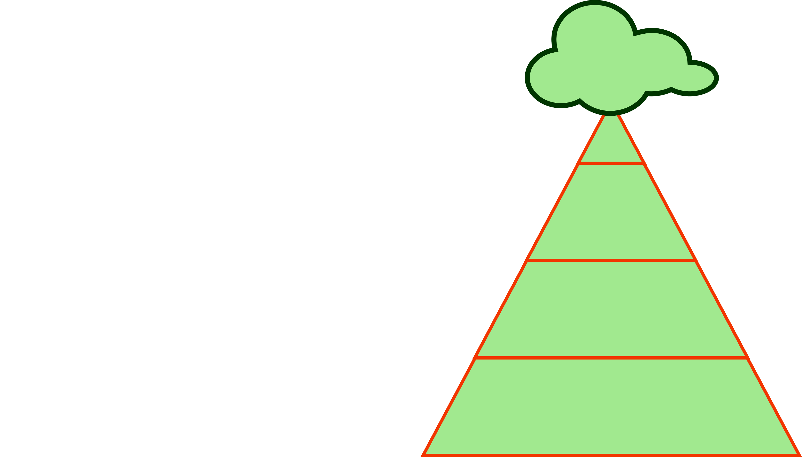
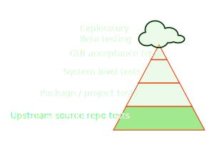
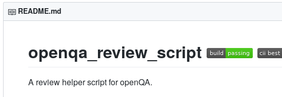
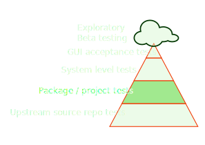
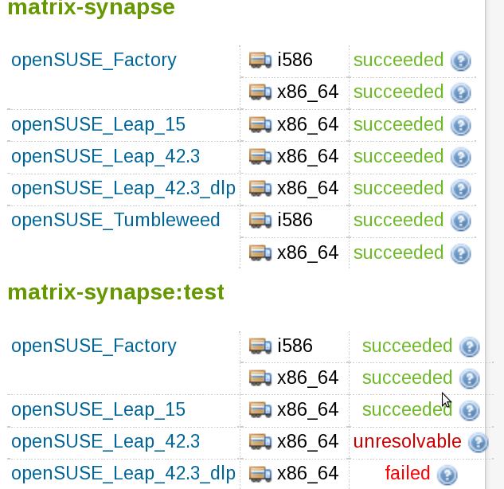
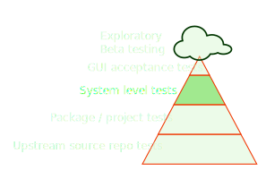
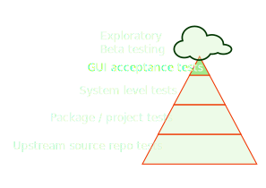
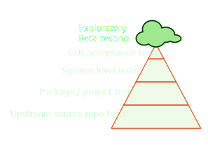

## Scope
* How is software within the openSUSE ecosystem tested?
* What kind of tests exist?
* Who is doing what?
* How is it done?
* Challenges

---

## Overview



Note:
This talk will try to present an overview of how "testing" is done for
software developed in the openSUSE ecosystem. The workflow of software
contributions to the openSUSE distributions will be shown from testing
perspective from upstream source code repos to feedback from users in the
released products. Used tools will be mentioned, the testing approaches as
well as the people involved. As this "overview" will not be able to cover all
approaches used by the community feedback by the audience in the Q&A part of
the talk will be appreciated. Of course, openQA will be included but it is
certainly not the only solution to be mentioned ;)

---

## Upstream source repo tests

<div class='left' style='float:left;width:48%'>

Everyone does that, right?
</div>
<div class='right' style='float:right;width:48%'>




<ul>
<li>Provides baseline for downstream tests</li>
<li>Hard to cover distribution integration</li>
</ul>
</div>

---

### Upstream source repo tests

* *Who:* Upstream communities
* *How:* Ecosystem dependant approaches
* *Why:* Fastest feedback, independant of distribution<br>
   &nbsp;&nbsp;&nbsp;&nbsp;&nbsp;&nbsp;&nbsp;&nbsp;&nbsp;&nbsp; … kinda ;)
* can be simple, e.g. python+pytest+tox, …

---

### … can be sophisticated

<div class='left' style='float:left;width:68%'>

</div>
<div class='right' style='float:right;width:28%'>

<ul>
<li>unit test</li>
<li>web based UI tests</li>
<li>container + VMs</li>
<li>automated administration</li>
</ul>
</div>

---

## Package / project tests

<div class='left' style='float:left;width:48%'>

"The foundation of distribution building"
</div>
<div class='right' style='float:right;width:48%'>
<ul>
<li>building is a "test"</li>
<li><i>%check</i> section in .spec files</li>
</ul>
</div>

---

## multibuild package self-test

* What if upstream tests are passing but your package is broken?
* What if openQA system tests are too late or too broad?

**Example project:**
https://build.opensuse.org/package/show/network:messaging:matrix/matrix-synapse

---

### What do you need?

Two files:

* _multibuild

```yaml
<multibuild>
    <package>test</package>
</multibuild>
```

---

### … and `<package>.spec`

```yaml
%if "@BUILD_FLAVOR@" == ""
%define _test 0
…
%endif

Name:           %{short_name}%{?name_ext}
…
%if 0%{?_test}
BuildRequires:  %{short_name}
%else
BuildRequires:  %{python_module base}
Requires:       python-bcrypt
…

%build
%if 0%{?_test}
synctl start
register_new_matrix_user --config homeserver.yaml --user opensuse \
    --password opensuse --admin https://localhost:8448
%else
%python_build
```

---

### build + test results



---

### … and `<package>.spec`

… and some boiler plate
```yaml
(another 20 ugly lines of %if/%else in the spec file)
```

not all people like that:


⇨ Use separate spec-files :)

---

## There is more on this level

* repository install checks
* review bots
* policy checks
* development project tests
* staging projects

---

### Package / project tests

* *Who:* Package / build project maintainer
* *How:* build, *%check*, OBS bots, CI systems + containers
* *Why:* Integration is crucial<br>
⇨ identify package impact before accepting

---

## System level tests

<div class='left' style='float:left;width:48%'>

Test end-to-end
</div>
<div class='right' style='float:right;width:48%'>

<ul>
<li>Test the "distribution" as a whole</li>
<li>Rely on all the pre-integration test results</li>
<li>Feed the product release decision process</li>
</ul>
</div>

---

## Main work horse – openQA


---

### openQA: Recent new features

* Containers definitions with images now fully supported
* Run test code from any git repository on production instances
* Automatic job labelling based on expressions in tickets
* Automatic investigation jobs on failures

---

## System level tests

* *Who:* Release management and quality assurance
* *How:* VMs, container, benchmarks, openQA et. al
* *Why:* This is what the user cares about

---

## GUI acceptance tests

<div class='left' style='float:left;width:48%'>

Where openQA shines ;)
</div>
<div class='right' style='float:right;width:48%'>

<ul>
<li>Ensure "love on first sight"</li>
<li>Its fun to develop!</li>
</ul>
</div>

---

### Finally something visual

<video data-autoplay src="img/openqa_kde.ogv"></video>

---

## GUI acceptance tests

* *Who:* Release management and quality assurance
* *How:* openQA, at least for the distribution experience itself
* *Why:* This is what the *desktop* user cares about

---

## Exploratory and Beta testing

<div class='left' style='float:left;width:48%'>

Manual – by definition
</div>
<div class='right' style='float:right;width:48%'>

<ul>
<li>Catches what was missed by automation</li>
<li>Provides feedback on where to extend tests</li>
</ul>
</div>

---

### Exploratory and Beta testing

* *Who:* Everyone
* *How:* Simply by using – are you providing the feedback?
* *Why:* No automation can be complete

---

## Points to take away

* Testing is no "phase"
* Everyone is involved
* Select the right tool for the purpose

--

## Optional: Walkthrough from source to shipping

* [upstream source project](http://github.com/os-autoinst/openQA)
* [unit- and integration tests](https://app.circleci.com/pipelines/github/os-autoinst/openQA)
* [trigger package update in OBS](https://build.opensuse.org/package/show/devel:openQA/openQA)
* [build and test for multiple products, devel project publish](http://download.opensuse.org/repositories/devel:/openQA/openSUSE_Tumbleweed/noarch/)
* [trigger "openQA-in-openQA" tests](https://openqa.opensuse.org/group_overview/24)
* [conduct openQA installation and fullstack test](https://openqa.opensuse.org/tests/latest?test=openqa_install%2Bpublish)
* [create submit request to openSUSE Factory](https://build.opensuse.org/request/show/704781)
* [running staging tests](https://build.opensuse.org/project/staging_projects/openSUSE:Factory/adi:89)
* [Tumbleweed snapshot test](https://openqa.opensuse.org/tests/latest?test=openqa_bootstrap&machine=64bit)
* [Tumbleweed release](https://openqa.opensuse.org/group_overview/1?limit_builds=1)

---

## Challenges

* More tests are good<br> … But how to know what is already tested?
* Some projects / packages are good at this<br> … But how to scale?
* Tests may fail in any step<br> … But who can keep an overview?

---

### The end … Questions? Corrections? Additions?

<p></p>

https://v.gd/okurz_osc19

<small>
Presentation created using <br><a href="https://github.com/krig/opensuse-presentation-template">https://github.com/krig/opensuse-presentation-template</a>
</small>

#### License
<small>
This slide deck is licensed under the Creative Commons Attribution-ShareAlike 4.0 International license.
It can be shared and adapted for any purpose (even commercially) as long as Attribution is given and any derivative work is distributed under the same license. Details can be found at <a href="https://creativecommons.org/licenses/by-sa/4.0/">https://creativecommons.org/licenses/by-sa/4.0/</a>
</small>
